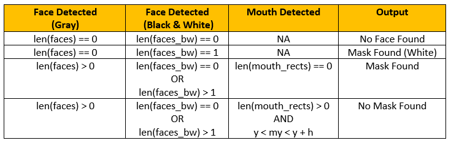

# Face Mask Detection
This Facial Mask Detector is purely based on OpenCV and Python.
<h3>There are two steps to implement a Facial Mask Detector:</h3>
<ol>
  <li>Identifying the mouth and the entire face</li>
  <li>Identifying whether the person in front of the camera is wearing a mask or not</li>
</ol>

<h3>Identifying the face and mouth:</h3>
<ol>
  <li>HAAR Cascade object --> CascadeClassifier()</li>
  <li>Camera input</li>
  <li>Gray scale conversion of the image</li>
  <li>detectMultiScale()</li>
</ol>

<h3>Identifying whether the person is wearing a mask or not</h3>
<ol>
  <li>Gray image face box</li>
  <li>Black & white image face box</li>
  <li>Gray image mouth rectangle</li>
</ol>

